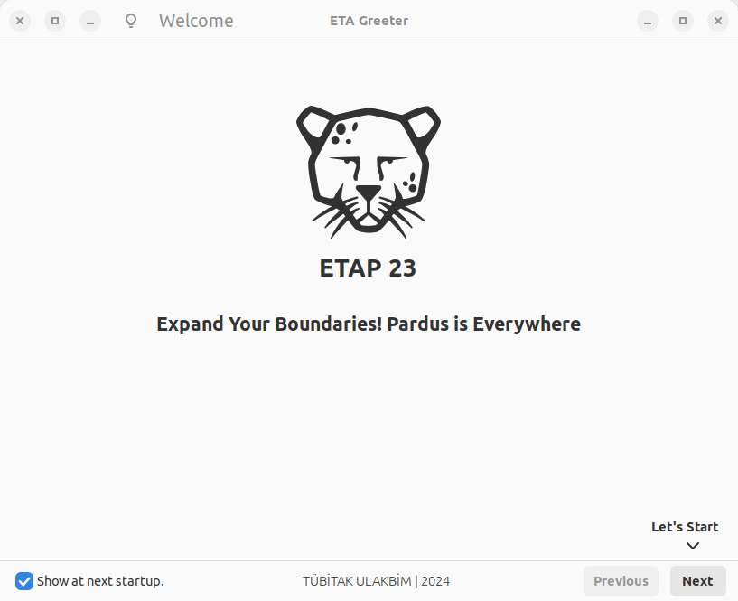
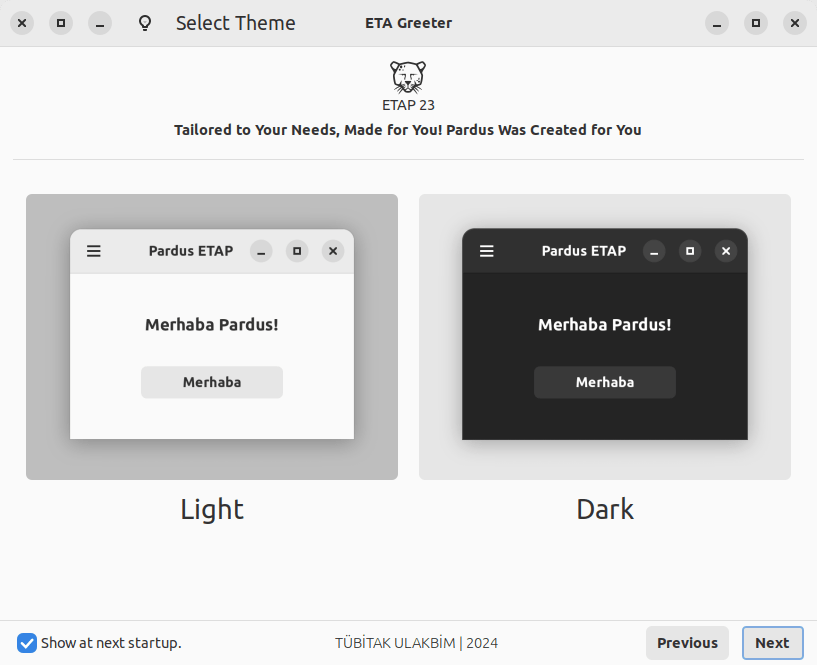
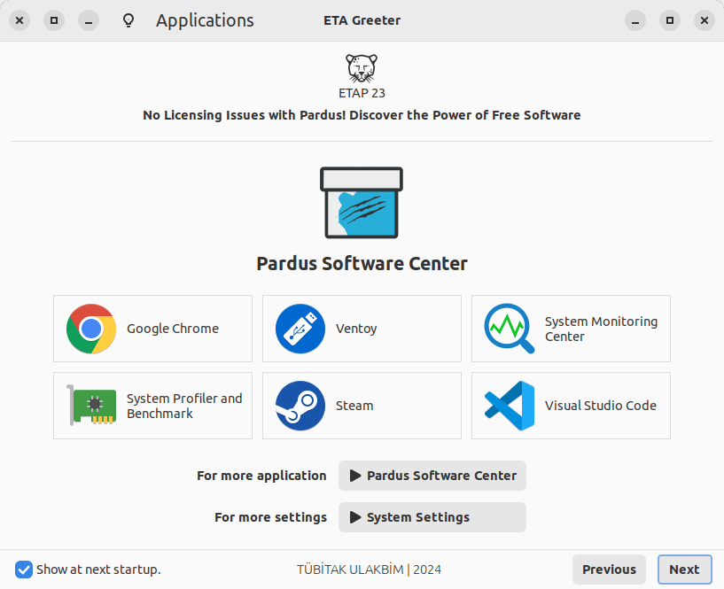

# ETA Cinnamon Greeter

ETA Cinnamon Greeter is a menu application.

[](https://repology.org/project/eta-cinnamon-greeter/versions)

### **Dependencies**

This application is developed based on Python3 and GTK+ 3. Dependencies:
```bash
gir1.2-gstreamer-1.0 gstreamer1.0-gtk3 gir1.2-cvc-1.0 gir1.2-glib-2.0 gir1.2-gtk-3.0
```

### **Run Application from Source**

Install dependencies
```bash
sudo apt install gir1.2-gstreamer-1.0 gstreamer1.0-gtk3 gir1.2-cvc-1.0 gir1.2-glib-2.0 gir1.2-gtk-3.0
```

Clone the repository
```bash
git clone https://github.com/pardus/eta-cinnamon-greeter.git ~/eta-cinnamon-greeter
```

Run application
```bash
python3 ~/eta-cinnamon-greeter/src/Main.py
```

### **Build deb package**

```bash
sudo apt install devscripts git-buildpackage
sudo mk-build-deps -ir
gbp buildpackage --git-export-dir=/tmp/build/eta-cinnamon-greeter -us -uc
```

### **Screenshots**










